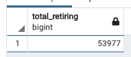
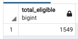
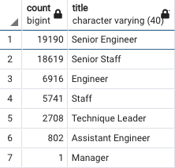
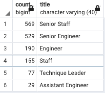

# Pewlett-Hackard-Analysis

## Overview
 For this project I was sorted data from multiple tables into three new tables: **retired employees**, **soon to be retired employees** and **current employees**. With this, I then created a Mentorship Eligibility table for current employees to be matched with retiring employees. This program will help foster better inter-employee relationships and in-turn will create a better, more impactful work environment. 
 
## Results
After creating this program and looking at the new tables created, there are four key take aways:
1. There is a large number of employees about to retire - about 54,000 employees int total. 

2. Relative to the number of employees retiring, there is a small number of employees that are eligible for the mentorship program. Only about 1,500 employees are eligible. 

3. There is the distribution in titles for the mentorship program and employees approaching retirement is evenly matched. We can see that for each title, there are more than enough reitiring employees for each current employees. This means that we won't have any issues where a current employee will be without a mentor. 

4. With so many employees approaching retirement, we may have issues  with staff shortages. It would be wise to focus on hiring, specificly for the Senior Engineer role, since it composes the largest number of employees approaching retirement. 

## Summary
How many roles will need to be filled as the "silver tsunami" begins to make an impact?
  There are a total of 53,977 employees approaching retirement, meaning that there will need to be a focus on hiring to replace all 53,977. The distribution of those retiring by title can be seen here:
  

  
  
Are there enough qualified, retirement-ready employees in the departments to mentor the next generation of Pewlett Hackard employees?
  There are more than enough qualified, retirement-ready employees in the departments to mentor the next generation. You can see with these two tables how there are far more retirement-ready employees by title than there are current-employees by title.
  
  
                      

